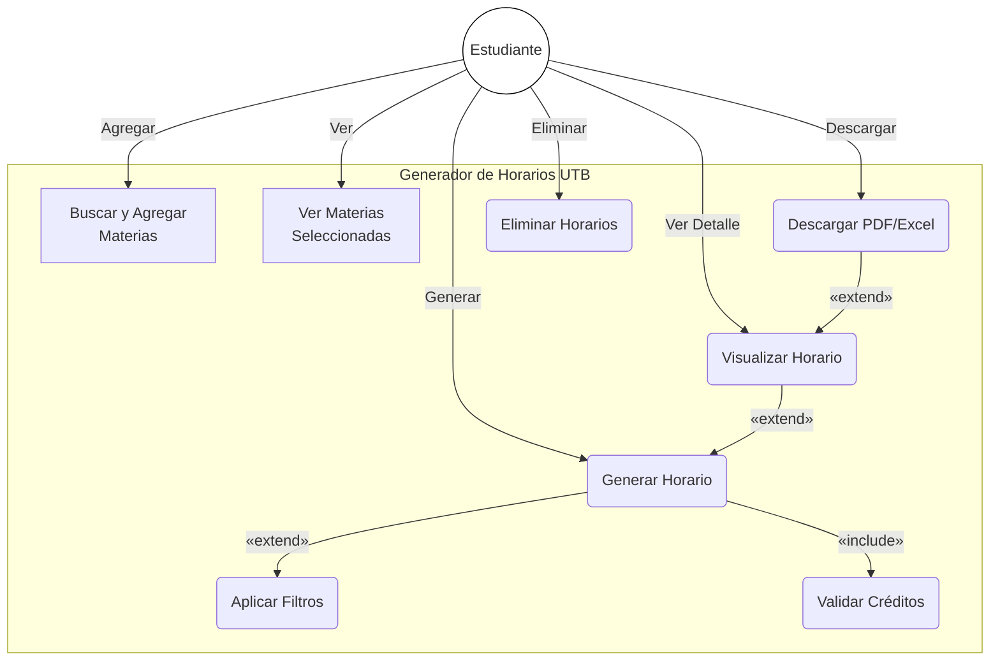

```mermaid
flowchart TB
    %% Definimos una clase para el actor (opcional)
    classDef actor fill:#ffffff,stroke:#000,stroke-width:1px

    %% Definimos al actor
    A((Estudiante)):::actor

    %% Agrupamos los casos de uso en un subgrafo que representa el sistema
    subgraph "Generador de Horarios UTB"
        UC1[Buscar y Agregar<br>Materias]
        UC2[Ver Materias<br>Seleccionadas]
        UC3(Generar Horario)
        UC4(Visualizar Horario)
        UC5(Descargar PDF/Excel)
        UC6(Eliminar Horarios)
        UC7(Aplicar Filtros)
        UC8(Validar Créditos)
    end

    %% Conexiones del actor con los casos de uso principales
    A -- Agregar--> UC1
    A -- Ver--> UC2
    A -- Generar--> UC3
    A -- Ver Detalle--> UC4
    A -- Descargar--> UC5
    A -- Eliminar--> UC6

    %% Relaciones include/extend
    UC3 -- «include» --> UC8
    UC3 -- «extend» --> UC7
    UC4 -- «extend» --> UC3
    UC5 -- «extend» --> UC4
```
