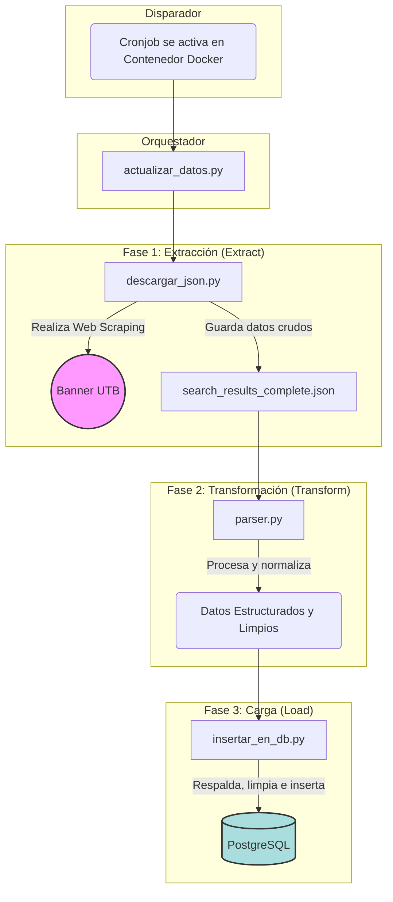

# Documentación del Backend

## 1. Arquitectura y Tecnologías

El backend está construido como una API RESTful utilizando **Python** y el framework **FastAPI**, conocido por su alto rendimiento y su capacidad para generar documentación interactiva automáticamente (Swagger UI).

La arquitectura sigue un patrón de diseño por capas para separar responsabilidades:

- **Capa de API (`main.py`, `routes/`):** Define los endpoints, gestiona las peticiones HTTP y las respuestas.
- **Capa de Servicio (`services/`):** Contiene la lógica de negocio compleja, como el algoritmo de generación de horarios.
- **Capa de Repositorio (`db/repository.py`):** Centraliza todo el acceso y las consultas a la base de datos, actuando como un puente entre la lógica de negocio y los datos.
- **Base de Datos:** Se utiliza **PostgreSQL** como sistema de gestión de base de datos, orquestado a través de **Docker**.

Todo el entorno (API, base de datos y scripts de actualización) está contenerizado con **Docker** y gestionado con **Docker Compose**, garantizando consistencia y facilidad de despliegue.

## 2. Estructura del Proyecto

El directorio `backend/` está organizado de la siguiente manera:

```txt
backend/
├── app/                  # Contiene el código fuente de la aplicación FastAPI.
│   ├── main.py           # Punto de entrada de la API, define endpoints y middleware.
│   ├── models.py         # Modelos de datos Pydantic para validación y serialización.
│   ├── Dockerfile        # Instrucciones para construir la imagen Docker de la API.
│   ├── db/
│   │   └── repository.py # Lógica de acceso a la base de datos.
│   ├── routes/
│   │   └── subject_routes.py # Rutas modulares para la gestión de materias.
│   └── services/
│       └── schedule_generator.py # Algoritmo de generación de horarios.
│
├── scripts/              # Scripts para la actualización y mantenimiento de datos.
│   ├── actualizar_datos.py # Orquesta todo el proceso de actualización.
│   ├── descargar_json.py   # Realiza web scraping para obtener los datos de Banner.
│   ├── parser.py           # Procesa y limpia el JSON crudo.
│   ├── insertar_en_db.py   # Inserta los datos procesados en la BD.
│   ├── backup.py           # Realiza respaldos de la base de datos.
│   ├── Dockerfile          # Conteneriza los scripts para ejecutarlos como un cronjob.
│   └── ...
│
├── .env                  # Variables de entorno para la aplicación FastAPI.
├── docker-compose.yml    # Define y orquesta los servicios de Docker (API, DB, Cron).
└── init.sql              # Script SQL para inicializar el esquema de la base de datos.
```

## 3. Flujo de Datos: Actualización Automática

Para mantener los datos de las materias actualizados, se ha implementado un pipeline ETL (Extract, Transform, Load) automatizado que se ejecuta periódicamente como un **cronjob** dentro de un contenedor Docker.



**1**. **Extract:** El script `descargar_json.py` simula ser un navegador para realizar peticiones al sistema Banner de la universidad, paginando a través de todos los resultados y guardando los datos crudos en `search_results_complete.json`.
**2**. **Transform:** `parser.py` lee el JSON crudo, lo limpia, normaliza nombres, identifica relaciones entre cursos teóricos y laboratorios, y estructura los datos en un formato listo para ser insertado en la base de datos.
**3**. **Load:** `insertar_en_db.py` orquesta la carga. Primero, llama a `backup.py` para crear un respaldo de los datos actuales. Luego, limpia las tablas y, finalmente, utiliza `inserter.py` para insertar los nuevos datos procesados en PostgreSQL.

## 4. Endpoints de la API

La API expone los siguientes endpoints para ser consumidos por el frontend:

---

### `POST /api/schedules/generate`

- **Descripción:** Es el endpoint principal. Recibe una lista de materias y un conjunto de filtros, y devuelve todas las combinaciones de horarios válidas que no tengan conflictos.
- **Request Body:**

  ```json
  {
    "subjects": ["DE456", "IS789"],
    "filters": {
      "timeFilters": { "Lunes": ["07:00", "08:00"] },
      "professors": {
        "include_professors": { "DE456": ["NOMBRE PROFESOR"] }
      },
      "optimizeGaps": true,
      "optimizeFreeDays": false
    }
  }
  ```

- **Respuesta Exitosa (200):** Una lista de horarios. Cada horario es una lista de objetos `ClassOption`.

  ```json
  [
    [
      /* Horario 1: Lista de ClassOption */
    ],
    [
      /* Horario 2: Lista de ClassOption */
    ]
  ]
  ```

---

### `GET /api/subjects`

- **Descripción:** Devuelve una lista ligera y resumida de todas las materias disponibles. Está optimizada para poblar rápidamente el widget de búsqueda del frontend.
- **Respuesta Exitosa (200):**

  ```json
  [
    { "code": "DE123", "name": "CÁLCULO I", "credits": 4 },
    { "code": "IS456", "name": "PROGRAMACIÓN AVANZADA", "credits": 3 }
  ]
  ```

---

### `GET /api/subjects/{subject_code}`

- **Descripción:** Obtiene toda la información detallada de una única materia, incluyendo todas sus `classOptions` (grupos, profesores, horarios, etc.).
- **Parámetro de Ruta:** `subject_code` (ej. "DE123").
- **Respuesta Exitosa (200):** Un objeto `Subject` completo, como se define en `models.py`.
- **Respuesta de Error (404):** Si la materia con el código especificado no se encuentra.

## 5. Configuración y Despliegue

- **Variables de Entorno:** La configuración de la base de datos se gestiona a través de archivos `.env`. Existe un `.env` en la raíz del backend para la aplicación FastAPI y otro en `scripts/` para los scripts de actualización.
- **Docker Compose:** El archivo `docker-compose.yml` es el punto de entrada para levantar todo el entorno. Define tres servicios:
  1. `api`: El contenedor de la aplicación FastAPI.
  2. `db`: El contenedor de la base de datos PostgreSQL.
  3. `cron`: El contenedor que ejecuta los scripts de actualización de forma periódica.
- **Ejecución:** Para iniciar el backend, simplemente ejecuta el siguiente comando desde el directorio `backend/`:

  ```bash
  docker-compose up -d
  ```
