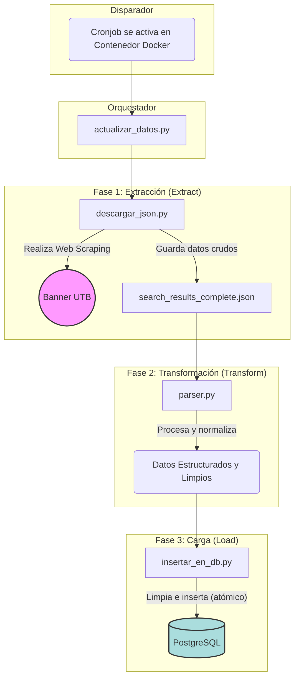

# Documentación del Backend

## 1. Arquitectura y Tecnologías

El backend está construido como una API RESTful utilizando **Python** y el framework **FastAPI**, conocido por su alto rendimiento y su capacidad para generar documentación interactiva automáticamente (Swagger UI).

La arquitectura sigue un patrón de diseño por capas para separar responsabilidades:

- **Capa de API (`main.py`, `routes/`):** Define los endpoints, gestiona las peticiones HTTP y las respuestas.
- **Capa de Servicio (`services/`):** Contiene la lógica de negocio compleja, como el algoritmo de generación de horarios.
- **Capa de Repositorio (`db/repository.py`):** Centraliza todo el acceso y las consultas a la base de datos, actuando como un puente entre la lógica de negocio y los datos.
- **Base de Datos:** Se utiliza **PostgreSQL** como sistema de gestión de base de datos, orquestado a través de **Docker**.

Todo el entorno (API, base de datos y scripts de actualización) está contenerizado con **Docker** y gestionado con **Docker Compose**, garantizando consistencia y facilidad de despliegue.

## 1.1 Registros Técnicos (Arquitectura)

Para mejorar mantenibilidad y trazabilidad, las decisiones relevantes se documentan como registros técnicos en `docs/issues/`.

Registros vigentes:

- `docs/issues/14-07-2026-creditos-decimales.md`
- `docs/issues/15-06-2026-incidente-wipe-oferta-etl-banner-caido.md`
- `docs/issues/12-05-2026-rfc-estados-cursos-notificaciones.md`
- `docs/issues/12-05-2026-pantalla-horarios-destacados.md`
- `docs/issues/10-05-2026-registro-sesiones-usuario.md`
- `docs/issues/08-05-2026-optimizacion-backups-retencion.md`
- `docs/issues/29-03-2026-rfc-horarios-destacados.md`
- `docs/issues/29-03-2026-politica-persistencia-etl.md`
- `docs/issues/07-08-2025-error-materias-laboratorio.md`

## 2. Estructura del Proyecto

El directorio `backend/` está organizado de la siguiente manera:

```txt
backend/
├── app/                  # Contiene el código fuente de la aplicación FastAPI.
│   ├── main.py           # Punto de entrada de la API, define endpoints y middleware.
│   ├── models.py         # Modelos de datos Pydantic para validación y serialización.
│   ├── auth/             # Autenticación OAuth con Microsoft Entra ID.
│   │   └── routes.py     # Flujo OAuth con PKCE, gestión de sesiones.
│   ├── db/
│   │   └── repository.py # Lógica de acceso a la base de datos.
│   ├── routes/
│   │   └── subject_routes.py # Rutas modulares para la gestión de materias.
│   └── services/
│       ├── schedule_generator.py    # Algoritmo de generación de horarios.
│       └── schedule_diagnostics.py  # Explica por qué no se generó ninguno.
│
├── scripts/              # Scripts para la actualización y mantenimiento de datos.
│   ├── actualizar_datos.py # Orquesta todo el proceso de actualización.
│   ├── descargar_json.py   # Realiza web scraping para obtener los datos de Banner.
│   ├── parser.py           # Procesa y limpia el JSON crudo.
│   ├── insertar_en_db.py   # Inserta los datos procesados en la BD.
│   ├── backup.py           # Realiza respaldos periódicos de datos de usuario.
│   ├── rescatador.py       # Recupera secciones ligadas incompletas.
│   ├── config.py           # Configuración compartida (conexión a BD, etc.).
│   └── utils.py            # Utilidades compartidas (timestamps, etc.).
│
├── Dockerfile            # Imagen Docker de la API FastAPI.
├── scripts.Dockerfile    # Imagen Docker para scripts ETL y backups.
├── .env                  # Variables de entorno para la aplicación FastAPI.
└── init.sql              # Script SQL para inicializar el esquema de la base de datos.
```

## 3. Flujo de Datos: Actualización Automática

Para mantener los datos de las materias actualizados, se ha implementado un pipeline ETL (Extract, Transform, Load) automatizado que se ejecuta periódicamente como un **cronjob** dentro de un contenedor Docker.


```mermaid
graph TD
    subgraph "Disparador"
        A(Cronjob se activa en Contenedor Docker)
    end

    subgraph "Orquestador"
        B[actualizar_datos.py]
    end

    A --> B

    subgraph "Fase 1: Extracción (Extract)"
        C[descargar_json.py]
        D((Banner UTB))
        E[search_results_complete.json]
        C -- Realiza Web Scraping --> D
        C -- Guarda datos crudos --> E
    end

    B --> C

    subgraph "Fase 2: Transformación (Transform)"
        F[parser.py]
        G(Datos Estructurados y Limpios)
        E --> F
        F -- Procesa y normaliza --> G
    end

    subgraph "Fase 3: Carga (Load)"
        H[insertar_en_db.py]
        I[(PostgreSQL)]
        G --> H
        H -- "Limpia e inserta (atómico)" --> I
    end

    style D fill:#f9f,stroke:#333,stroke-width:2px
    style I fill:#add,stroke:#333,stroke-width:2px
```

**1**. **Extract:** El script `descargar_json.py` simula ser un navegador para realizar peticiones al sistema Banner de la universidad, paginando a través de todos los resultados y guardando los datos crudos en `search_results_complete.json`.
**2**. **Transform:** `parser.py` lee el JSON crudo, lo limpia, normaliza nombres, identifica relaciones entre cursos teóricos y laboratorios, y estructura los datos en un formato listo para ser insertado en la base de datos.
**3**. **Load:** `insertar_en_db.py` orquesta la carga mediante una limpieza de tablas académicas y su reinserción en una única transacción atómica. Si ocurre un error, se ejecuta rollback y se conserva el estado previo. (*Nota:* Los backups ahora corren de forma paralela e independiente de este ETL, enfocándose en los datos de usuario).

## 4. Endpoints de la API

La API expone los siguientes endpoints para ser consumidos por el frontend:

---

### `POST /api/schedules/generate`

- **Descripción:** Es el endpoint principal. Recibe una lista de materias y un conjunto de filtros, y devuelve todas las combinaciones de horarios válidas que no tengan conflictos.
- **Request Body:**

  ```json
  {
    "subjects": [
      {"code": "DE456", "name": "NOMBRE DE LA MATERIA"},
      {"code": "IS789", "name": "OTRA MATERIA"}
    ],
    "filters": {
      "timeFilters": { "Lunes": ["07:00", "08:00"] },
      "professors": {
        "include_professors": { "DE456": ["NOMBRE PROFESOR"] }
      },
      "optimizeGaps": true,
      "optimizeFreeDays": false
    },
    "creditLimit": 25,
    "isMobile": false
  }
  ```

  `isMobile` (opcional, default `false`): si es `true`, el backend limita la cantidad de horarios devueltos (ver cap más abajo). El frontend lo envía según el User-Agent del dispositivo.

- **Respuesta Exitosa (200):** Un objeto con los horarios y si la lista fue truncada.

  ```json
  {
    "schedules": [
      [ /* Horario 1: Lista de ClassOption */ ],
      [ /* Horario 2: Lista de ClassOption */ ]
    ],
    "truncated": false
  }
  ```

  `truncated` es `true` cuando se aplicó el cap móvil y había más horarios de los devueltos (el frontend muestra "N+").

- **Respuesta sin horarios (200):** cuando `schedules` viene vacío se agrega `diagnosis`, que explica **por qué**. Es `null` cuando sí hay horarios (no se calcula: costo cero en el camino feliz).

  ```json
  {
    "schedules": [],
    "truncated": false,
    "diagnosis": {
      "shape": "par_incompatible",
      "blame": "estructural",
      "subjects": [],
      "pairs": [["Física", "Cálculo"]],
      "removalOptions": ["Física", "Cálculo"],
      "blockingFilters": []
    }
  }
  ```

  Dos ejes independientes: `shape` dice **dónde vive** el conflicto (`sin_oferta`, `materia_sin_opciones`, `par_incompatible`, `conjunto_incompatible`) y `blame` **de quién es la culpa** (`datos`, `filtros`, `estructural`). `removalOptions` son alternativas (basta quitar una); vacío = quitar una sola no alcanza. `blockingFilters` solo aplica con `blame=filtros`; vacío ahí = es la combinación de filtros, no uno puntual.

  Lo calcula `services/schedule_diagnostics.py` sobre las combinaciones **completas y sin fusionar** (la respuesta del generador no sirve: viene fusionada y capada). Se apoya en `schedule_generator.has_any_schedule`, que es el backtracking con **salida temprana** al primer horario válido — a diferencia de `find_valid_schedules`, que enumera todo.

  Ver `docs/issues/17-07-2026-rfc-diagnostico-sin-horarios.md` para la taxonomía completa y por qué es exhaustiva.

- **Cap de resultados (solo móvil):** la explosión combinatoria puede producir decenas de miles de horarios; cargarlos todos agota la memoria del navegador móvil. Cuando `isMobile=true`, se devuelven como máximo `MAX_SCHEDULES` (env, default **500**); escritorio recibe todos. Como cualquier orden/filtro re-llama al generador, basta devolver los mejores N para el criterio actual.

---

### `GET /api/subjects`

- **Descripción:** Devuelve una lista ligera y resumida de todas las materias disponibles. Está optimizada para poblar rápidamente el widget de búsqueda del frontend.
- **Respuesta Exitosa (200):**

  ```json
  [
    { "code": "DE123", "name": "CÁLCULO I", "credits": 4 },
    { "code": "IS456", "name": "PROGRAMACIÓN AVANZADA", "credits": 3 },
    { "code": "RU789", "name": "SEMINARIO DE DESARROLLO PERSONAL", "credits": 0.5 }
  ]
  ```

  `credits` es decimal: hay materias de créditos fraccionarios (ej. 0.5).

---

### `GET /api/subjects/{subject_code}?name=...`

- **Descripción:** Obtiene toda la información detallada de una única materia, incluyendo todas sus `classOptions` (grupos, profesores, horarios, etc.).
- **Parámetro de Ruta:** `subject_code` (ej. "DE123").
- **Parámetro de Consulta:** `name` — Nombre de la materia (requerido, ya que la PK de materia es compuesta).
- **Respuesta Exitosa (200):** Un objeto `Subject` completo, como se define en `models.py`.
- **Respuesta de Error (404):** Si la materia con el código y nombre especificados no se encuentra.

## 5. Autenticación (Microsoft Entra ID)

El módulo `app/auth/` implementa autenticación OAuth 2.0 con **Authorization Code Flow + PKCE** contra Microsoft Entra ID.

### Flujo de autenticación

1. El frontend redirige a `/api/auth/login`.
2. El backend genera parámetros PKCE (`code_verifier` + `code_challenge`) y redirige a Microsoft.
3. Microsoft autentica al usuario y retorna un `code` a `/api/auth/callback`.
4. El backend intercambia el `code` por tokens usando `httpx`, valida el tenant, y decodifica el `id_token` con `python-jose`.
5. Se crea o actualiza el usuario en la base de datos (`get_or_create_user`).
6. Se registra el inicio de sesión en la tabla `sesion_usuario`.
7. Se crea una sesión en memoria y se establece una cookie `session_id`.

### Endpoints de autenticación

| Método | Endpoint | Descripción |
|--------|----------|-------------|
| `GET` | `/api/auth/login` | Inicia flujo OAuth (redirige a Microsoft) |
| `GET` | `/api/auth/callback` | Callback tras autenticación en Microsoft |
| `GET` | `/api/auth/me` | Retorna info del usuario de la sesión actual |
| `POST` | `/api/auth/logout` | Cierra sesión y retorna URL de logout de Microsoft |

### Endpoints de favoritos (horarios destacados)

| Método | Endpoint | Descripción |
|--------|----------|-------------|
| `GET` | `/api/favorites?term=202610` | Lista los favoritos del usuario autenticado para un término |
| `GET` | `/api/favorites/terms` | Retorna términos disponibles con favoritos + término actual |
| `GET` | `/api/favorites/status?nrcs=12345,67890` | Estado de cupos actuales de una lista de NRCs (Fase 2) |
| `POST` | `/api/favorites` | Crea un horario destacado |
| `DELETE` | `/api/favorites/{id}` | Elimina un horario destacado (valida ownership) |

**Autorización:** Todos los endpoints requieren la cookie `session_id` (sesión activa). Si no hay sesión → 401.

**GET /api/favorites/status — Response:**
```json
{
  "12345": { "available": 15, "total": 30 },
  "67890": { "available": 0, "total": 25 }
}
```

Consulta los cupos actuales en la tabla `Curso` (`CuposDisponibles`/`CuposTotales`). Los NRC inexistentes se omiten (el frontend los trata como "eliminado"). Solo refleja el **término actual** (la tabla `Curso` se reescribe en cada corrida del ETL); el frontend no lo invoca para periodos pasados. Ver `docs/issues/12-05-2026-rfc-estados-cursos-notificaciones.md`.

**POST /api/favorites — Request Body:**
```json
{
  "signature": "11111-12345-67890",
  "schedule": [/* lista de ClassOption serializadas */]
}
```

**GET /api/favorites/terms — Response:**
```json
{
  "currentTerm": "202610",
  "availableTerms": ["202610", "202601"]
}
```

**Límites:** Máximo 20 favoritos por usuario por término. Si se excede → 429.

**Configuración:** El término actual se define con `CURRENT_TERM` en `backend/.env`. Esta variable es leída por la API y por los scripts de actualización de datos. Actualizar una sola vez cada semestre.

### Limitaciones conocidas

- Las sesiones se almacenan **en memoria** del proceso API. Si el contenedor se reinicia, todas las sesiones se pierden y los usuarios deben re-autenticarse.
- Esto también limita el escalado horizontal (múltiples instancias de la API no comparten sesiones).
- Para escalado futuro, considerar migrar a Redis o sesiones en base de datos.

## 6. Configuración y Despliegue

- **Variables de Entorno:** La configuración de la base de datos y autenticación se gestiona a través del archivo `.env` en la raíz del backend. Los scripts de actualización acceden a estas variables a través de la configuración de Docker (env_file en docker-compose).
- **Docker Compose:** El archivo `docker-compose.yml` en la raíz del proyecto es el punto de entrada para levantar todo el entorno. Define los siguientes servicios:
  1. `backend`: El contenedor de la aplicación FastAPI.
  2. `db`: El contenedor de la base de datos PostgreSQL.
  3. `initial-data`: Contenedor que pobla la BD con datos iniciales (se ejecuta una vez).
  4. `cron-updater`: El contenedor que ejecuta los scripts de actualización de forma periódica.
  5. `frontend`: El contenedor con Flutter Web + Nginx.
  6. `certbot`: Renovación automática de certificados SSL (solo producción).
- **Ejecución:** Para iniciar todo el entorno, ejecuta el siguiente comando desde la raíz del proyecto:

  ```bash
  docker-compose up -d
  ```
