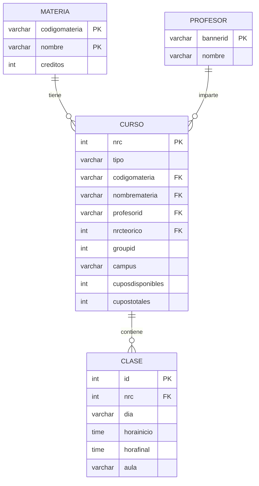

# Modelo de Datos

Este documento describe el esquema de la base de datos PostgreSQL utilizada por el sistema.

## Diagrama Entidad-Relación

## Entidades

### Materia

Representa una asignatura académica del plan de estudios.

| Campo | Tipo | Descripción |
|-------|------|-------------|
| `codigomateria` | VARCHAR | Código único de la materia (PK) |
| `nombre` | VARCHAR | Nombre de la materia (PK) |
| `creditos` | INTEGER | Número de créditos académicos |

> La clave primaria es compuesta (`codigomateria`, `nombre`) porque una misma materia puede tener diferentes nombres según el programa (ej: "ÉTICA Y CIUDADANÍA" vs "ÉTICA PROFESIONAL" con el mismo código).

---

### Curso

Representa una oferta específica de una materia en el período académico actual.

| Campo | Tipo | Descripción |
|-------|------|-------------|
| `nrc` | INTEGER | Número de Registro de Curso (PK) |
| `tipo` | VARCHAR | Tipo de clase: `Teórico`, `Laboratorio`, `Teorico-practico` |
| `codigomateria` | VARCHAR | Código de la materia (FK) |
| `nombremateria` | VARCHAR | Nombre específico del curso |
| `profesorid` | VARCHAR | ID del profesor en Banner (FK) |
| `nrcteorico` | INTEGER | NRC del curso teórico asociado (para laboratorios) |
| `groupid` | INTEGER | Identificador de grupo |
| `campus` | VARCHAR | Sede donde se imparte |
| `cuposdisponibles` | INTEGER | Cupos disponibles actualmente |
| `cupostotales` | INTEGER | Capacidad máxima del curso |

---

### Clase

Representa un bloque horario específico de un curso.

| Campo | Tipo | Descripción |
|-------|------|-------------|
| `id` | INTEGER | Identificador único (PK, autoincremental) |
| `nrc` | INTEGER | NRC del curso al que pertenece (FK) |
| `dia` | VARCHAR | Día de la semana |
| `horainicio` | TIME | Hora de inicio |
| `horafinal` | TIME | Hora de finalización |
| `aula` | VARCHAR | Aula o salón asignado |

---

### Profesor

Representa a un docente de la universidad.

| Campo | Tipo | Descripción |
|-------|------|-------------|
| `bannerid` | VARCHAR | Identificador único en Banner (PK) |
| `nombre` | VARCHAR | Nombre completo del profesor |

## Relaciones

| Relación | Tipo | Descripción |
|----------|------|-------------|
| Materia → Curso | 1:N | Una materia tiene múltiples cursos (grupos) |
| Profesor → Curso | 1:N | Un profesor puede impartir varios cursos |
| Curso → Clase | 1:N | Un curso tiene uno o más bloques horarios |
| Curso → Curso | N:1 | Laboratorios se vinculan a su teórico via `nrcteorico` |

## Tipos de Curso

El sistema maneja tres tipos de cursos:

1. **Teórico:** Clase magistral, generalmente 2-3 bloques semanales.
2. **Laboratorio:** Práctica asociada a un teórico, vinculado via `nrcteorico`.
3. **Teorico-practico:** Combinación de teoría y práctica en un solo NRC.

### Agrupación por `groupid`

El campo `groupid` permite agrupar cursos que deben tomarse juntos:
- Un teórico y su laboratorio comparten el mismo `groupid`
- El algoritmo usa esto para generar combinaciones válidas

## Script de Inicialización

El archivo `backend/init.sql` contiene el esquema completo y se ejecuta automáticamente al crear el contenedor de PostgreSQL por primera vez.
