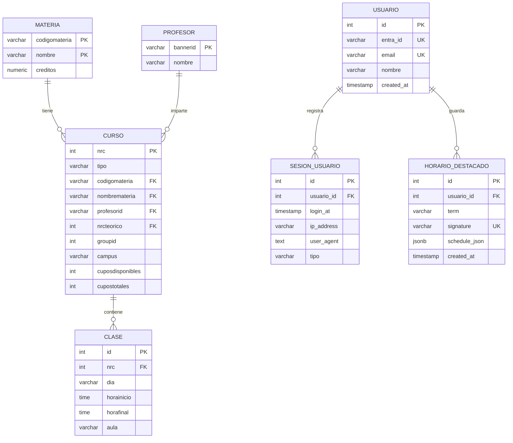
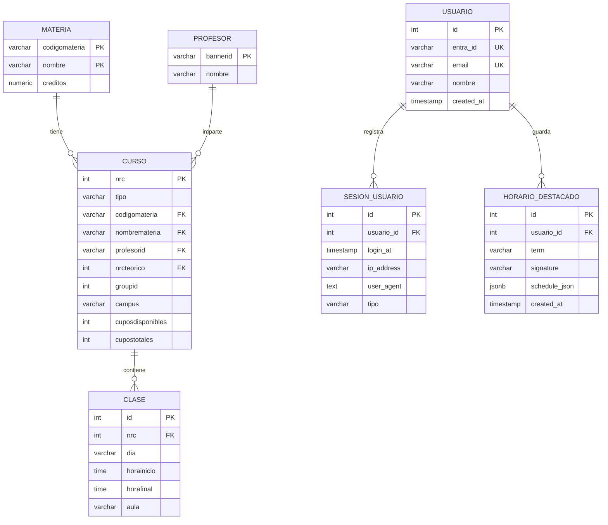

# Modelo de Datos

Este documento describe el esquema de la base de datos PostgreSQL utilizada por el sistema.

## Alcance del Documento

Este documento describe el esquema completo de la base de datos, incluyendo las tablas de datos académicos, gestión de usuarios, registro de sesiones y horarios destacados (favoritos).

## Diagrama Entidad-Relación (Estado Actual)

```mermaid
erDiagram
    MATERIA ||--o{ CURSO : tiene
    PROFESOR ||--o{ CURSO : imparte
    CURSO ||--o{ CLASE : contiene

    MATERIA {
        varchar codigomateria PK
        varchar nombre PK
        numeric creditos
    }

    CURSO {
        int nrc PK
        varchar tipo
        varchar codigomateria FK
        varchar nombremateria FK
        varchar profesorid FK
        int nrcteorico FK
        int groupid
        varchar campus
        int cuposdisponibles
        int cupostotales
    }

    CLASE {
        int id PK
        int nrc FK
        varchar dia
        time horainicio
        time horafinal
        varchar aula
    }

    PROFESOR {
        varchar bannerid PK
        varchar nombre
    }

    USUARIO {
        int id PK
        varchar entra_id UK
        varchar email UK
        varchar nombre
        timestamp created_at
    }

    USUARIO ||--o{ SESION_USUARIO : registra
    USUARIO ||--o{ HORARIO_DESTACADO : guarda

    SESION_USUARIO {
        int id PK
        int usuario_id FK
        timestamp login_at
        varchar ip_address
        text user_agent
        varchar tipo
    }

    HORARIO_DESTACADO {
        int id PK
        int usuario_id FK
        varchar term
        varchar signature UK
        jsonb schedule_json
        timestamp created_at
    }
```

## Diagrama Entidad-Relación (Detallado)

```mermaid
erDiagram
    MATERIA ||--o{ CURSO : tiene
    PROFESOR ||--o{ CURSO : imparte
    CURSO ||--o{ CLASE : contiene

    MATERIA {
        varchar codigomateria PK
        varchar nombre PK
        numeric creditos
    }

    CURSO {
        int nrc PK
        varchar tipo
        varchar codigomateria FK
        varchar nombremateria FK
        varchar profesorid FK
        int nrcteorico FK
        int groupid
        varchar campus
        int cuposdisponibles
        int cupostotales
    }

    CLASE {
        int id PK
        int nrc FK
        varchar dia
        time horainicio
        time horafinal
        varchar aula
    }

    PROFESOR {
        varchar bannerid PK
        varchar nombre
    }

    USUARIO {
        int id PK
        varchar entra_id UK
        varchar email UK
        varchar nombre
        timestamp created_at
    }

    USUARIO ||--o{ SESION_USUARIO : registra
    USUARIO ||--o{ HORARIO_DESTACADO : guarda

    SESION_USUARIO {
        int id PK
        int usuario_id FK
        timestamp login_at
        varchar ip_address
        text user_agent
        varchar tipo
    }

    HORARIO_DESTACADO {
        int id PK
        int usuario_id FK
        varchar term
        varchar signature
        jsonb schedule_json
        timestamp created_at
    }
```

## Entidades

### Materia

Representa una asignatura académica del plan de estudios.

| Campo | Tipo | Descripción |
|-------|------|-------------|
| `codigomateria` | VARCHAR | Código único de la materia (PK) |
| `nombre` | VARCHAR | Nombre de la materia (PK) |
| `creditos` | NUMERIC(4,2) | Número de créditos académicos. Decimal: hay materias de créditos fraccionarios (ej. 0.5) y con INTEGER se redondeaban a 0 |

> La clave primaria es compuesta (`codigomateria`, `nombre`) porque una misma materia puede tener diferentes nombres según el programa (ej: "ÉTICA Y CIUDADANÍA" vs "ÉTICA PROFESIONAL" con el mismo código).

---

### Curso

Representa una oferta específica de una materia en el período académico actual.

| Campo | Tipo | Descripción |
|-------|------|-------------|
| `nrc` | INTEGER | Número de Registro de Curso (PK) |
| `tipo` | VARCHAR | Tipo de clase: `Teórico`, `Laboratorio`, `Teorico-practico` |
| `codigomateria` | VARCHAR | Código de la materia (FK) |
| `nombremateria` | VARCHAR | Nombre específico del curso |
| `profesorid` | VARCHAR | ID del profesor en Banner (FK) |
| `nrcteorico` | INTEGER | NRC del curso teórico asociado (para laboratorios) |
| `groupid` | INTEGER | Identificador de grupo |
| `campus` | VARCHAR | Sede donde se imparte |
| `cuposdisponibles` | INTEGER | Cupos disponibles actualmente |
| `cupostotales` | INTEGER | Capacidad máxima del curso |

---

### Clase

Representa un bloque horario específico de un curso.

| Campo | Tipo | Descripción |
|-------|------|-------------|
| `id` | INTEGER | Identificador único (PK, autoincremental) |
| `nrc` | INTEGER | NRC del curso al que pertenece (FK) |
| `dia` | VARCHAR | Día de la semana |
| `horainicio` | TIME | Hora de inicio |
| `horafinal` | TIME | Hora de finalización |
| `aula` | VARCHAR | Aula o salón asignado |

---

### Profesor

Representa a un docente de la universidad.

| Campo | Tipo | Descripción |
|-------|------|-------------|
| `bannerid` | VARCHAR | Identificador único en Banner (PK) |
| `nombre` | VARCHAR | Nombre completo del profesor |

---

### Usuario (Actual)

Representa a un usuario autenticado con Microsoft Entra ID.

| Campo | Tipo | Descripción |
|-------|------|-------------|
| `id` | SERIAL | Identificador interno (PK) |
| `entra_id` | VARCHAR | Identificador de Microsoft Entra (UNIQUE) |
| `email` | VARCHAR | Correo institucional/personal (UNIQUE) |
| `nombre` | VARCHAR | Nombre para mostrar |
| `created_at` | TIMESTAMP | Fecha de creación del registro |

Estado de implementación:
- La tabla existe en `backend/init.sql`.
- Hay funciones de acceso en `backend/app/db/repository.py`.
- El callback de autenticación sincroniza usuario en DB con `get_or_create_user`.
- La sesión HTTP sigue almacenándose en memoria del proceso API (limitación conocida para escalado horizontal).

---

### Sesión de Usuario

Registra cada inicio de sesión de un usuario en la aplicación.

| Campo | Tipo | Descripción |
|-------|------|-------------|
| `id` | SERIAL | Identificador único del registro (PK) |
| `usuario_id` | INTEGER | Usuario que inició sesión (FK a `usuario.id`) |
| `login_at` | TIMESTAMP | Fecha y hora del inicio de sesión |
| `ip_address` | VARCHAR(45) | Dirección IP del cliente (IPv4 o IPv6) |
| `user_agent` | TEXT | Navegador/dispositivo del cliente |
| `tipo` | VARCHAR(10) | Tipo de evento: `login` (OAuth) o `visita` (sesión existente) |

Estado de implementación:
- La tabla existe en `backend/init.sql`.
- Los logins se registran automáticamente en el callback de autenticación (`auth/routes.py`).
- Las visitas se registran en `/api/auth/me` con throttle de 15 minutos por sesión.
- Los datos se incluyen en los backups periódicos.

---

### Horario Destacado

Representa un horario guardado por el usuario como favorito.

| Campo | Tipo | Descripción |
|-------|------|-------------|
| `id` | SERIAL | Identificador del favorito (PK) |
| `usuario_id` | INTEGER | Usuario propietario del favorito (FK a `usuario.id`) |
| `term` | VARCHAR | Período académico (ej. `202610`) |
| `signature` | VARCHAR | Huella estable del horario (para evitar duplicados) |
| `schedule_json` | JSONB | Snapshot del horario tal como se mostró al usuario |
| `created_at` | TIMESTAMP | Fecha de creación del favorito |

Restricción:
- `UNIQUE (usuario_id, term, signature)` para evitar duplicados por usuario (implementada en `init.sql`).

Estado de implementación:
- La tabla y la restricción existen en `backend/init.sql`.
- CRUD completo en `routes/favorite_routes.py` + `repository.py` (máx. 20 favoritos por término).
- Pantalla dedicada con previsualización y estado de cupos en vivo (Fase 2). El estado se consulta con `GET /api/favorites/status` contra la tabla `Curso` y solo aplica al término actual.

## Relaciones

| Relación | Tipo | Descripción |
|----------|------|-------------|
| Materia → Curso | 1:N | Una materia tiene múltiples cursos (grupos) |
| Profesor → Curso | 1:N | Un profesor puede impartir varios cursos |
| Curso → Clase | 1:N | Un curso tiene uno o más bloques horarios |
| Curso → Curso | N:1 | Laboratorios se vinculan a su teórico via `nrcteorico` |
| Usuario → Sesión de Usuario | 1:N | Un usuario tiene múltiples registros de inicio de sesión |
| Usuario → Horario Destacado | 1:N | Un usuario puede guardar múltiples horarios destacados |

## Tipos de Curso

El sistema maneja tres tipos de cursos:

1. **Teórico:** Clase magistral, generalmente 2-3 bloques semanales.
2. **Laboratorio:** Práctica asociada a un teórico, vinculado via `nrcteorico`.
3. **Teorico-practico:** Combinación de teoría y práctica en un solo NRC.

### Agrupación por `groupid`

El campo `groupid` permite agrupar cursos que deben tomarse juntos:
- Un teórico y su laboratorio comparten el mismo `groupid`
- El algoritmo usa esto para generar combinaciones válidas

## Script de Inicialización

El archivo `backend/init.sql` contiene el esquema completo y se ejecuta automáticamente al crear el contenedor de PostgreSQL por primera vez.

Nota operativa:
- Si el volumen de la base de datos ya existe, cambios nuevos en `init.sql` no se aplican automáticamente.
- Para cambios de esquema en ambientes persistentes se requieren migraciones versionadas.
